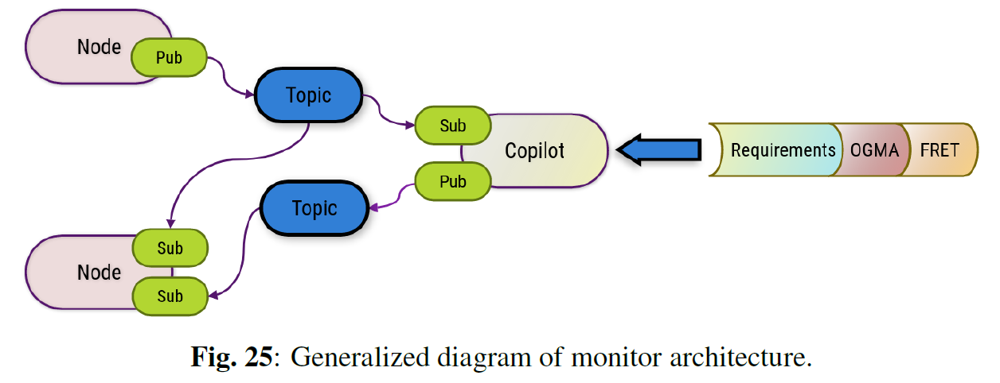

# M30-RB Runtime Verification Framework

This is the collected repository consisting of all parts of a framework for runtime verification of ROS2 systems,
including instructions as well as personal findings and goals.

The primary goal of this project is to automatically develop a robust RV platform for ROS 2 applications
from Natural Language (NL) requirements, equipped with a user interface. This platform aims to facilitate
user interaction with the ROS system through simple commands and will be applicable to both CPS
and simulation environments. The monitor should demonstrate reliable, high-performance results during
execution. Additionally, the RV monitors should be capable of being automatically generated from nearnatural
language requirements, which can be converted into formally verified temporal logic for precise
verification.

<a href="NMBU_Master_Thesis.pdf" class="image fit"></a>

## System Requirements

The system is designed to meet the following requirements, in no particularly order (see thesis for detailed explanation):
1. ROS 2 Compatibility
2. Low Latency and High Performance
3. Bidirectional Communication
4. Linux Compatibility
5. Hard Real-Time Capabilities
6. Formal Verification
7. Violation Detection and Reporting

### Software developed by NASA, utilized in the framework:
[FRET github](https://github.com/NASA-SW-VnV/fret/tree/master)

[OGMA github](https://github.com/nasa/ogma)

## Video Demo

### YouTube Embed

[](https://youtu.be/gVkXQGgXUrk)

### Direct Link

[Watch the video](https://youtu.be/gVkXQGgXUrk)

## Workflow

The inspiration for advancing RV in ROS 2 applications came from the paper ”Automated Translation
of Natural Language Requirements to Runtime Monitors” by Dr. Ivan Perez and his team at NASA. The
paper outlines the steps for creating C monitors for ROS 2 from FRET input in the following seven steps:

1. Fret automatically translates requirements into pure Past-time Metric Linear Temporal Logic
(ptLTL) formulas.
2. Information about the variables referenced in the requirements must be provided by the user.
3. The formulas and provided variable data are then combined to generate the Component Specification.
4. Based on this specification, OGMA creates a complete Copilot monitor specification.
5. Copilot then generates the C Monitor. 
6. This monitor, along with other C code, is given to a C compiler.
7. The final object code is generated.

### ROBOTOOL (optional)

### FRET
1. (optional) import requirements from ROBOTOOL
1. Create requirements in FRET, either following the templates or by using the fields system. Pay attention to what should be assumptions (done by adding "assumption" to requirements name). 
2. Apply variable mapping. Check chart for information regarding the difference between the classes and how to do this correctly.
3. Check realizability. If unrealizable go back to step 1.
4. If realizable export json of project with requirements and variables.
   
### OGMA

1. Create copilot monitors
2. create ROS2 structure
3. Compile the copilot code and move the .h and .c files to the ROS2 directory


### ROS2

1. Integrate C++ monitors with ROS2, focusing on correct topic paths and information gathering
2. Create violation handeling from the hanbdler topics listed in the C code, if wanted. 
3. Test system and add further functions if wanted. Bidirectional communication and mitigation actions being examples of further development. 



# Master's in Applied Robotics use-case

The increased use of autonomous robotic systems has necessitated advancements in safety measures due
to the potential hazards these systems can pose. This increased focus on automation and robotic systems
raises questions on how safety and compliance will be maintained in a steadily advancing automated society.
With increasing complexity, it has become evident that rigorous offline testing cannot eliminate all
dangers associated with infinite state systems, as safety is limited by the defined test-cases and coverage.
To maintain safety and reliability during runtime, multiple tools often need to be set in place. One such
tool is called Runtime Verification (RV). Runtime verification, a term that has been growing in popularity,
refers to lightweight formal methods for observing, analyzing, and sometimes intercepting the processes
of system software or Cyber-Physical Systems (CPS). One of the most common software libraries for
CPS robotics is the Robot Operating System (ROS). While ROS has a few runtime verification software
tools available, the recent release of ROS 2 has created a gap regarding compatible tools and their usage.
Especially with the shift in infrastructure from a centralized- to distributed discovery. In the case of a
flawed or failing safety controller, runtime verification plays a pivotal role in detecting what went wrong,
when and where it occurred, and how to administer possible mitigating actions. The primary objective of
this thesis is to create a pipeline for the automatic generation of RV monitors for ROS 2 from natural language
requirements into formally verified temporal logic equations. To achieve this, the pipeline employs
NASA’s Copilot, OGMA, and FRET tools to convert natural language safety requirements into formally
verified temporal logic monitors.

This study also addresses the gap in RV tools for ROS 2, providing a comprehensive overview of
existing tools, implementation strategies, and the benefits of RV in CPS. The framework’s performance
is evaluated through simulation and field testing using the Thorvald-005 agricultural-robot and D435
RealSense camera, focusing on system overhead, event-to-stream-based communication, and violation
reporting efficiency.

Key findings demonstrate that the RV framework effectively improves safety and reliability, with the
monitor maintaining acceptable system performance even under high message rates. The research also
highlights the importance of acknowledging hardware limitations and enhancing predictive capabilities to
further increase system robustness. The findings prove that the automatic generation of formally verified
RV monitors for ROS 2 is possible with current software and is quick to implement or change, making it
feasible to test multiple specification models on the same system without changing the source code.

Future work involves refining the generative RV framework, improving hardware integration, and
extending compatibility to other ROS distributions. The results have contributed to the ongoing development
of the NASA RV tools, promoting safer deployment of autonomous systems in agriculture and other
domains. This thesis itself is a contribution to the methodology and knowledge ascertained to properly
understand and use Linear Temporal Logic (LTL) monitors.

## hds_and_website

To build the packages run:
```
colcon build --packages-select yolov6
```
and
```
colcon build --packages-select pyflask
```
To use this project you will need a few packages.

### For the Realsense depth-camera packages:

You can follow the installation section here : https://github.com/IntelRealSense/realsense-ros#installation

Or simply run:
```
sudo apt install ros-<ROS_DISTRO>-librealsense2*
```
and
```
sudo apt install ros-<ROS_DISTRO>-realsense2-*
```

For the YOLO package you will need a few packages like CV2 and pytorch, but I leave the installation up to you
You will probably get nice error messages for missing packages. These should be added when called upon.

### Before running the yolo prediction you have to launch the camera node. Run:
```
ros2 launch realsense2_camera rs_launch.py enable_rgbd:=true enable_sync:=true align_depth.enable:=true enable_color:=true enable_depth:=true 
```

Among other things this makes sure the resolution and FOV of the RBG image and depth image is the same. This is required by the current yolo solution

### To run the Yolo-prediction by itself:
```
ros2 run yolov6 inferer
```

### If you get an error message that says:
**ImportError: /lib/x86_64-linux-gnu/libstdc++.so.6: cannot allocate memory in static TLS block**

You can run:
```
export LD_PRELOAD=/usr/lib/x86_64-linux-gnu/libstdc++.so.6:/usr/lib/x86_64-linux-gnu/libgcc_s.so.1:$LD_PRELOAD
```

## ras_reliability_backend

Robotics and Automation Society (ras) focused development on runtime verification monitors for use with ROS2 systems. Setup for front-end webpage for monitoring and violation reporting.

### Installation packages

If this is your first time using this package remember to do the following:
```
sudo apt install ros-<ROS_DISTRO>-rosbridge-server
source /opt/ros/<ROS_DISTRO>/setup.bash
```

## Launching package

### To run the website together with the yolo prediction:
```
ros2 launch pyflask my_launch_file.launch
```

### If you want to change the yolo model:

The path to the .pt file and the .yaml file that contains the corresponding labels can be changed at the bottom of yolov6/yolov6/core/inferer.py

inferer.py is pretty much the only file you will want to edit for the yolo model. Except maybe the model .pt file and label yaml. Everything you will need is probably there.

You can also change which image topic is sent to the website and shown on your pc

(CHECK THIS) The possible images are:
raw image topic from depth camera

img_ori (full rbg with predictions)

pred_img (rgb image cropped with only predicitons)

pred_depth_img (depth image cropped with only predicitons, sections are used to calculate distance)


### For rosbridge server to run for use with injection device
```
ros2 launch rosbridge_server rosbridge_websocket_launch.xml
```
### To run the irmt_teleop package with plugins
```
ros2 launch imrt_teleop turtlebot_teleop.launch.py 
```
### Rosbag file with video of adult and worker walking down corridor.
[Video Link](https://drive.google.com/drive/folders/1jtmLMNx-0xZPhMIur5fxFwlo8PuJ-N6X?usp=sharing)

### Remember to add pathing to the .so plugins inside each plugins src/build in ~/.bashrc or export manually


